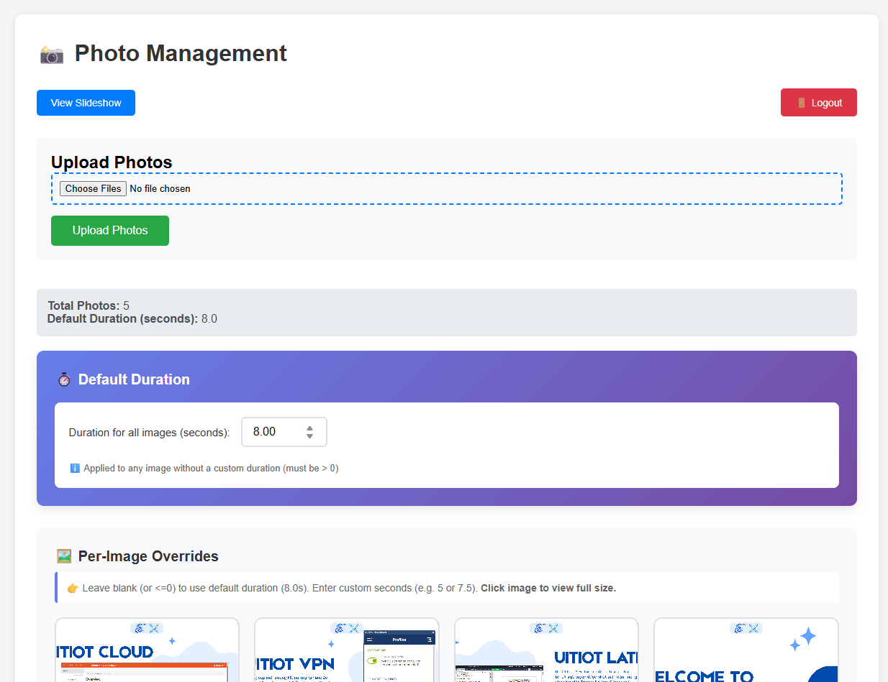

# SlideShow Web Application

## Overview
SlideShow is a lightweight Flask web application for displaying a full-screen photo slideshow with per-image configurable display durations. An admin interface lets you upload, delete, and set custom durations for each image, as well as a global default duration stored in `durations.json`.



## Features
- Simple responsive slideshow at `/`
- **Secure admin dashboard** at `/admin` with login authentication
- Admin interface: bulk upload, duration editing, delete images, click to view full-size
- Per-image and default display duration (`durations.json` with `__default` key)
- Safe filename handling (Werkzeug `secure_filename`)
- Supports common image formats: png, jpg, jpeg, gif, bmp, webp
- REST endpoints for upload, delete, and duration updates
- Beautiful gradient UI with modal image preview

## Tech Stack
- Python 3
- Flask
- Flask-Login (for authentication)

## Project Structure
```
├── main.py               # Flask application entrypoint
├── durations.json        # Stores per-image and default durations
├── photos/               # Uploaded images
├── templates/            # Jinja2 templates (index & admin)
├── Dockerfile            # Container build
├── docker-compose.yml    # Optional compose setup
├── requirements.txt      # Python dependencies
└── README.md
```

## Installation (Local)
```bash
python3 -m venv .venv
source .venv/bin/activate
pip install -r requirements.txt
python main.py  # runs on http://0.0.0.0:8080
```

## Run with Docker
Build and run directly:
```bash
docker build -t slideshow .
docker run -p 8080:8080 \
	-v "$(pwd)/photos:/app/photos" \
	-v "$(pwd)/durations.json:/app/durations.json" \
	slideshow
```

Or via compose (auto rebuild):
```bash
docker compose up --build
```

## Admin Login
The admin dashboard is protected by authentication. Default credentials:
- **Username:** `admin`
- **Password:** `admin123`

⚠️ **Important:** Change these credentials in production!

### How to Change Username/Password
Edit `main.py` and modify these lines:
```python
# Default admin account (should be changed in production)
ADMIN_USERNAME = 'admin'
ADMIN_PASSWORD_HASH = generate_password_hash('admin123')  # Password: admin123
```

To change:
1. Update `ADMIN_USERNAME` to your desired username
2. Replace `'admin123'` in `generate_password_hash('admin123')` with your new password
3. Restart the application

Example:
```python
ADMIN_USERNAME = 'myusername'
ADMIN_PASSWORD_HASH = generate_password_hash('mySecurePassword123!')
```

## Endpoints
| Route | Method | Purpose |
|-------|--------|---------|
| `/` | GET | Run slideshow |
| `/login` | GET/POST | Admin login page |
| `/logout` | GET | Logout and return to slideshow |
| `/admin` | GET | Manage images & durations (requires login) |
| `/upload` | POST | Upload multiple images (requires login) |
| `/durations` | POST | Update per-image + default duration (requires login) |
| `/delete/<filename>` | POST | Delete an image (requires login, JSON response) |
| `/photos/<filename>` | GET | Serve a raw image |

## Customization
- **Change secret key:** edit `app.secret_key` in `main.py` (use env var in production).
- **Change admin credentials:** see [Admin Login](#admin-login) section above.
- **Increase max upload size:** adjust `app.config['MAX_CONTENT_LENGTH']`.
- **Add formats:** update `ALLOWED_EXTENSIONS` set.

## Troubleshooting
- Blank slideshow: ensure images exist in `photos/` and have supported extensions.
- Durations not applied: verify `durations.json` syntax and floating point values.
- Upload fails: check file size < 16MB and allowed extensions.

## Contributing
Issues and pull requests are welcome. Keep changes focused and small.

